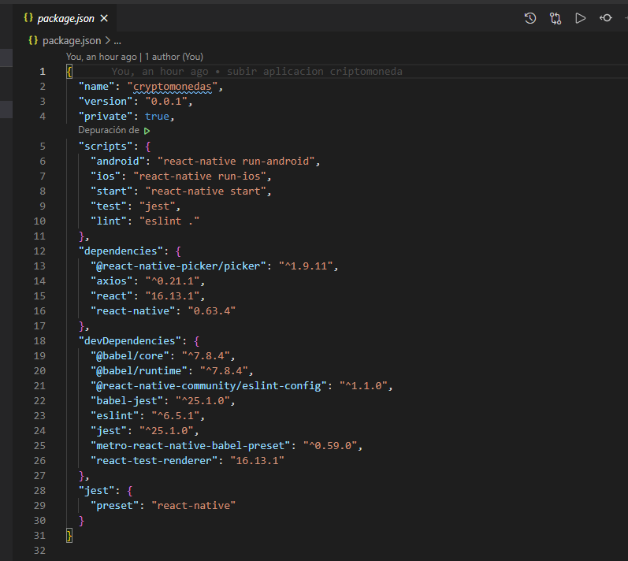

# Criptomonedas

Cryptocurrencies is an application where we can see at what price is the most important cryptocurrencies that exist, we can see the highest price on the day, the lowest, when it has been the last variation and its last update.

### Codigo Principal

* El codigo principal se encuentra en el archivo App.js y los distintos componentes en la carpeta components

### Installation Environment / Tools:
* React Native
* VSCode
* API (https://min-api.cryptocompare.com/documentation?key=Price&cat=multipleSymbolsPriceEndpoint)
* Chocolatey
* Android Studios

### Dependence

### Captura

